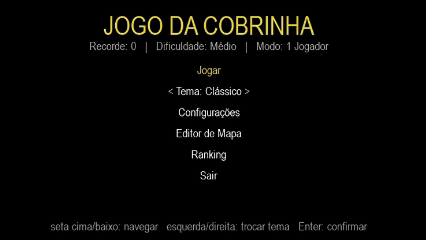

# 🐍 Snake Game

Uma versão moderna do clássico **Jogo da Cobrinha**, desenvolvida em **Python** utilizando **Pygame**.

O projeto começou como uma implementação simples do Snake e evoluiu para um jogo completo, com múltiplos modos de jogo, inteligência artificial, editor de mapas, ranking local, configurações persistentes e até uma versão experimental para navegador utilizando **Pygbag**.

---

## 📷 Preview





---

## 🚀 Tecnologias

- 🐍 Python
- 🎮 Pygame
- ⚡ Asyncio
- 🌐 Pygbag (versão WebAssembly)
- 💾 JSON e arquivos locais para persistência

---

## ✨ Funcionalidades

### 🎮 Modos de jogo

- 1 Jogador
- 2 Jogadores (local)
- Jogador vs Bot (IA)

---

### 🐍 Mecânicas

- Crescimento da cobra
- Aumento automático da velocidade
- Sistema de fases
- Obstáculos dinâmicos
- Parede sólida ou atravessável
- Comidas especiais
- Escudo temporário
- Animação suave de movimento
- Partículas ao coletar comida

---

### 🤖 Inteligência Artificial

O projeto possui um modo **Jogador vs Bot**.

A IA:

- procura o menor caminho até a comida
- evita paredes
- evita obstáculos
- evita colisões com o próprio corpo
- reage dinamicamente durante a partida

---

### 🗺️ Editor de mapas

Crie mapas personalizados diretamente dentro do jogo.

É possível:

- adicionar obstáculos
- remover obstáculos
- salvar mapas
- reutilizar mapas nas partidas

---

### ⚙️ Sistema de Configurações

O jogo permite configurar:

- Volume
- Velocidade inicial
- Dificuldade
- Tipo de parede
- Tema visual
- Modo de jogo
- Mapa personalizado

Todas as configurações são salvas automaticamente.

---

### 🏆 Ranking

Sistema de ranking local com Top 10 jogadores.

Recursos:

- registro do nome
- armazenamento em JSON
- recorde permanente
- classificação automática

---

### 🎨 Temas

O jogo possui quatro temas visuais:

- 🎮 Clássico
- 💜 Neon
- ❄️ Gelo
- 🏜️ Deserto

Cada tema altera completamente a aparência do jogo.

---

### 🔊 Áudio

Os efeitos sonoros são gerados dinamicamente durante a execução.

Não é necessário incluir arquivos de áudio no projeto.

---

## 🎮 Controles

### Durante a partida

| Ação | Tecla |
|------|-------|
| Mover | WASD ou Setas |
| Pausar | P ou ESC |

---

### Menu

| Ação | Tecla |
|------|-------|
| Navegar | Setas |
| Alterar tema | ← → |
| Confirmar | Enter |

---

### Tela de Game Over

| Ação | Tecla |
|------|-------|
| Jogar novamente | R |
| Voltar ao menu | M |
| Sair | Q |

---

### Editor de mapas

| Ação | Tecla |
|------|-------|
| Mover cursor | Setas |
| Adicionar obstáculo | Espaço |
| Salvar | S |
| Limpar | C |
| Cancelar | ESC |

---

## 📂 Estrutura do Projeto

```text
jogo-cobrinha/
├── main.py                  # ponto de entrada (python main.py)
├── requirements.txt         # dependências de runtime (pygame, numpy)
├── requirements-dev.txt     # + pytest, para rodar os testes
├── conftest.py              # configuração dos testes (SDL headless, sys.path)
├── pytest.ini
├── cobrinha/                # pacote com o código do jogo
│   ├── config.py            # constantes, tipos e persistência (config/recorde/ranking/mapa)
│   ├── sons.py               # geração e controle dos efeitos sonoros
│   ├── entidades.py          # Cobra, Particula, geração de mundo, IA do bot, fases
│   ├── telas.py               # menu, configurações, editor de mapa, ranking, pausa, fim
│   └── jogo.py                # entrada de teclado, laço principal e orquestração (main)
└── tests/                   # suíte de testes automatizados (pytest)
    ├── test_config.py
    ├── test_entidades.py
    └── test_jogo.py
```

---

## ⚙️ Como executar

Clone o projeto

```bash
git clone https://github.com/SEU-USUARIO/snake-game.git
```

Entre na pasta

```bash
cd snake-game
```

Instale as dependências

```bash
pip install -r requirements.txt
```

Execute

```bash
python cobrinha.py
```

---

## 🌐 Versão Web (Experimental)

O projeto possui suporte ao **Pygbag**, permitindo executar o jogo diretamente no navegador.

Instale:

```bash
pip install pygbag
```

Execute:

```bash
python -m pygbag cobrinha.py
```

Depois acesse:

```
http://localhost:8000
```

### Observações

- O desempenho pode variar entre navegadores.
- Os arquivos de configuração utilizam o sistema de armazenamento virtual do navegador.
- Esta funcionalidade ainda é experimental.

---

## 💾 Persistência

O jogo salva automaticamente:

- Configurações
- Ranking
- Recorde
- Mapas personalizados

Arquivos utilizados:

```
config.txt
ranking.json
recorde.txt
mapa_personalizado.txt
```

---

## 🚀 Roadmap

### ✅ Implementado

- [x] Menu inicial
- [x] Sistema de fases
- [x] Ranking
- [x] Recorde
- [x] Configurações
- [x] IA para o Bot
- [x] Dois jogadores
- [x] Editor de mapas
- [x] Temas
- [x] Comidas especiais
- [x] Obstáculos
- [x] Escudo temporário
- [x] Partículas
- [x] Sons
- [x] Animação suave
- [x] Compatibilidade com navegador

### 💡 Futuras melhorias

- [ ] Gamepad
- [ ] Conquistas (Achievements)
- [ ] Multiplayer Online
- [ ] Mais mapas
- [ ] Mais temas
- [ ] Sistema de missões
- [ ] Estatísticas do jogador
- [ ] Salvamento em nuvem
- [ ] Leaderboard Online

---

## 📚 Conceitos aplicados

Este projeto demonstra diversos conceitos importantes de desenvolvimento de jogos:

- Programação Orientada a Objetos
- Game Loop
- Inteligência Artificial
- Algoritmos de movimentação
- Persistência em arquivos
- Manipulação de JSON
- Asyncio
- Sistema de partículas
- Animações
- Colisão
- Controle de estados do jogo
- Configurações persistentes
- Estrutura modular

---

## 👨‍💻 Autor

Desenvolvido por **Higor Lima**.

💼 Líder no desenvolvimento IoT  
💻 Desenvolvedor Front-end / Back-end

**Tecnologias:** Python • C# • React • TypeScript • JavaScript • .NET

⭐ Se este projeto foi útil para você, deixe uma estrela no repositório.